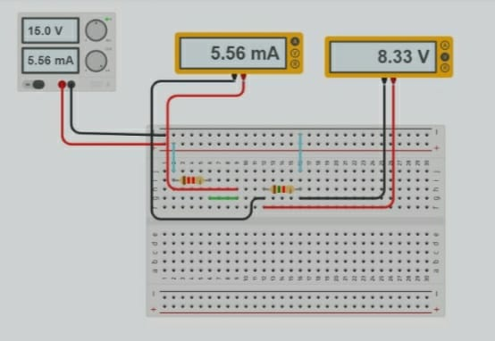

# PRÁCTICA No. 6 Teorema de la Máxima Transferencia de Potencia

#### Integrantes:

CALDERON VIDAL MATEO ESTEBAN

CAMACHO SIZA JOSUE EVERETT

GUEVARA CARVAJAL LUIS EDUARDO

#### NRC:

5406

## Objetivos

***Objetivo General***

- Comprender  el Teorema de la Máxima Transferencia de Potencia, para determinar los voltajes y las corrientes presentes en un circuito eléctrico.

***Objetivos específicos***

- Comprobar la efectividad del uso del teorema de la Máxima Transferencia de Potencia para el análisis de circuitos.

- Realizar comparaciones entre los datos teóricos usando el Teorema de la Máxima Transferencia de Potencia y los datos prácticos adquiridos en el desarrollo de la práctica.

- Entender las conexiones y forma de uso del protoboard, del multímetro y de los   demás materiales de laboratorio para hacer un uso correcto de ellos, ya que cada uno tiene una forma específica de uso.

## Marco teórico

## Explicación del procedimiento

***Material y equipo requerido***

Tabla I. Materiales y Equipo

***Pasos a seguir***

1. Iniciar el Tinkercad y seleccionar los materiales a utilizar.

2. Preparar los materiales en el simulador: resistencia con cada valor y la fuente de energía.

3. Elaborar un circuito con las resistencias con la forma indicada en la guía.

4. Medir cada uno de los voltajes, corrientes de las Resistencias y anotar los resultados.

5. Analizar el circuito por el teorema la Máxima Transferencia de Potencia para obtener los resultados analíticos de cada voltaje y de cada corriente.

6. Completar las tablas respectivas con cada uno de los resultados obtenidos.

***Procedimiento***

Figura 1.- Circuito para comprobar el Teorema de la MTP

## Resultados

Tabla II. Parámetros Eléctricos del circuito 

***Porcentaje de error relativo entre los valores teóricos y los experimentales***

***Análisis de los resultados***

- **Se cumple el Teorema de la Máxima Transferencia de Potencia? Argumente su respuesta.**

Se puede concluir que mientras más cerca sea la resistencia de carga con la resistencia de Thevenin cumpliremos con el Teorema de la Máxima Transferencia de Potencia,

- **¿Cuál fue la potencia máxima en RL?**

La mayor potencia fue la de 46.79 mW

- **¿Para qué valor de RL se obtiene la MTP?**

Para el valor de 1000 Ω

## Video

## Conclusiones

## Anexos

*Anexo 1.- Circuito en Tinkercad.*

*Anexo 2.- Circuito en Tinkercad.*

*Anexo 3.- Circuito en Tinkercad.*

*Anexo 4.- Circuito en Tinkercad.*

*Anexo 5.- Circuito en Tinkercad.*

*Anexo 6.- Circuito en Tinkercad.*

*Anexo 7.- Circuito en Tinkercad.*

*Anexo 8.- Circuito en Tinkercad.*

*Anexo 9.- Circuito en Tinkercad.*

*Anexo 9.- Circuito en Tinkercad.*

## Bibliografía

FisicaPractica.com. (2007). Fisica practica. Obtenido de Fisica practica: https://www.fisicapractica.com/transferencia.php

Gómez, A. J. (Enero de 2019). Universidad de los Andes. Obtenido de Universidad de los Andes: http://wwwprof.uniandes.edu.co/~ant-sala/cursos/FDC/Contenidos/06_Thevenin_Norton_Maxima_Transferencia_de_Potencia.pdf

Wikipedia. (12 de Diciembre de 2020). Wikipedia.org. Obtenido de Wikipedia.org: https://es.wikipedia.org/wiki/Teorema_de_m%C3%A1xima_potencia

